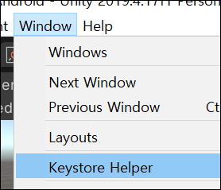
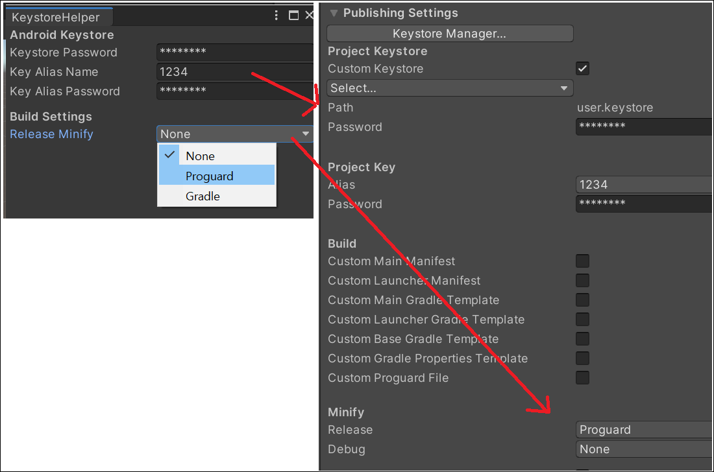
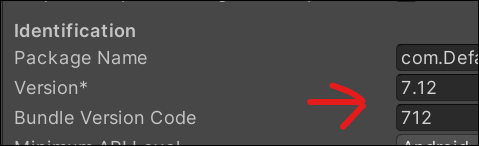
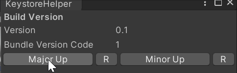

# 키스토어 도우미

유니티 에디터를 새로 열면 안드로이드 키스토어 값을 새로 넣어야 하는 불편함이 있어서 이를 도와주는 도우미입니다.

처음 1회 설정하면 그 후에는 신경쓰지 않아도 됩니다.

## 특징

키스토어 정보를 파일로 암호화해서 기록합니다.

기존 [Keystore Helper](https://assetstore.unity.com/packages/tools/utilities/keystore-helper-58627)은 다른 기기에서 프로젝트를 열면 다시 키를 입력해줘야 했습니다.

개인적으로 이 부분이 불편해서 파일로 기록해서 다른 곳에서 프로젝트를 받아도 바로 사용할 수 있도록 내부 로직을 수정하였습니다.

## 사용법

키스토어가 생성되어 있어야 합니다.

[Window > Keystore Helper] 창을 엽니다.

각 정보를 입력합니다.

### 버전 관리

빌드 버전을 올려줘야 할 때 Version 값과 Build Version Code 값을 둘다 수정해줘야 해서 이걸 올려주는 기능을 UI에 추가했습니다.

각 버튼마다 Major Up, Minor Up은 앞과 뒷 자리를 증가시키는 기능이고 버튼 뒤에 R 버튼들은 해당 자리를 0으로 초기화 하는 동작을 합니다.

## 고마운 분들

- [KeystoreHelper github](https://github.com/megahard/KeystoreHelper)
- [파일 저장 및 암호화](https://glikmakesworld.tistory.com/14)

## 라이선스

MIT